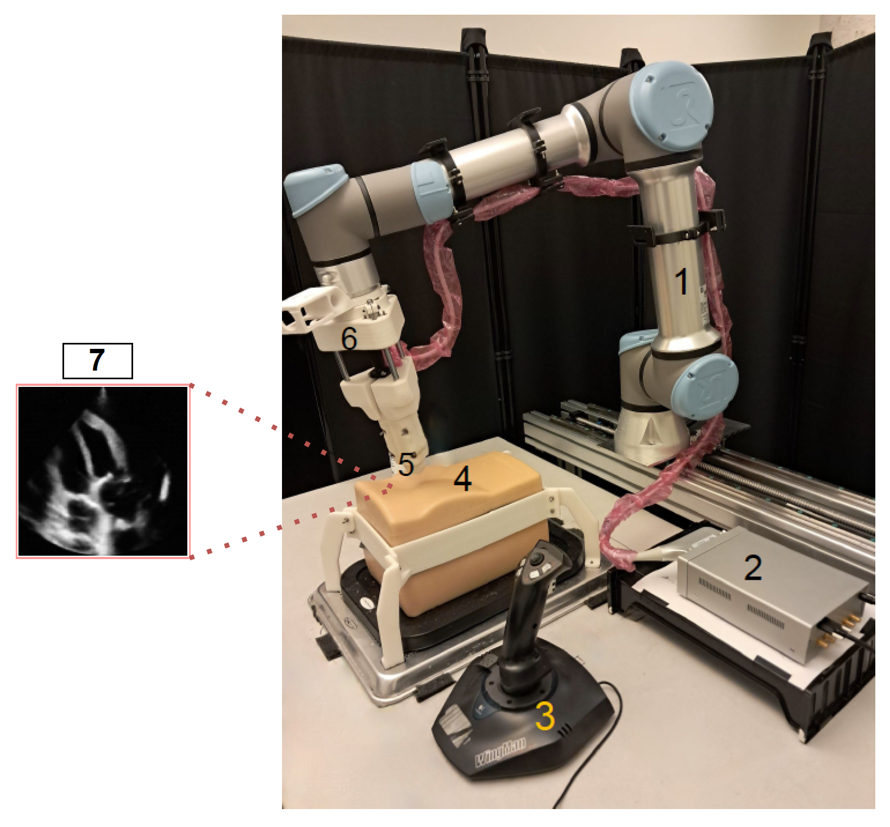
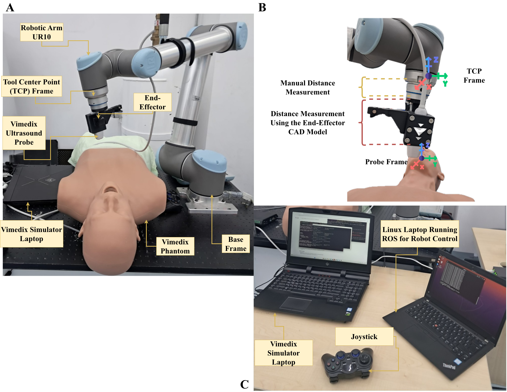

# Autonomous-Ultrasound-Scanning 
The goal of this project is to develop an artificial intelligence-based solution that guides a robotic arm to perform cardiac ultrasound scanning. The project was tested on two different phantoms: the Elevate Healthcare Blue Cardiac Phantom and the Elevate Healthcare Vimedix Simulator.  Two different robotic platforms, UR5e (Universal Robot) and UR10 (Universal Robot), were used for the experiments.

The contribution of the robotic platforms is divided between two teams:

- Experiment with UR5e: Team DR. Xie Wenfnag from the Department of Mechanical, Industrial and Aerospace Engineering at Concordia University, Montreal, Canada.

 
 
- Experiment with UR10: Team DR. Yahya Zweiri from the Advanced Research and Innovation Centre (ARIC) at Khalifa University, Abu Dhabi, UAE.

